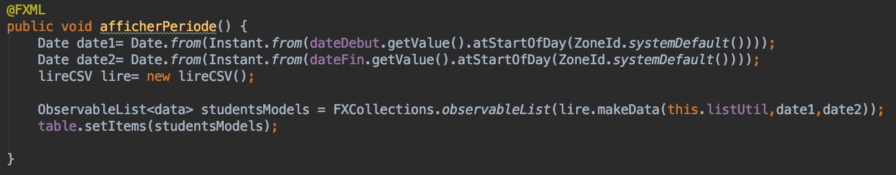
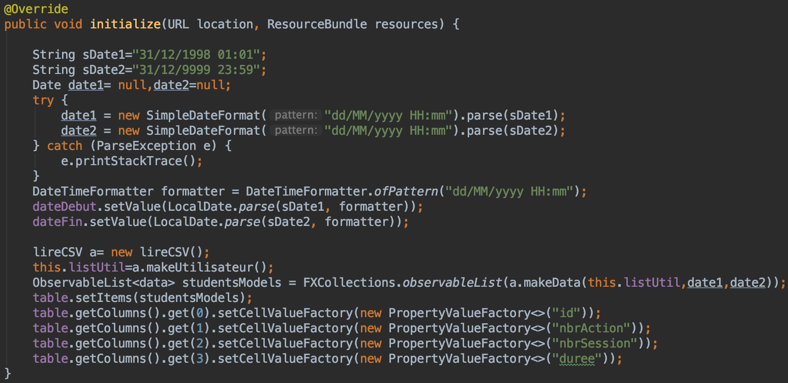

# Détail classe Controller

Classe qui fait le lien entre l'interface graphique FXML et notre code Java.

## Attributs :   

* table: TableView<data>
* dateDebut : DatePicker
* dateFin : DatePicker
* listUtil List<Utilisateur>

## Fonctions :
### afficherPeriode

Lors du clic sur le bouton de notre interface graphique, cela déclenche la fonction afficherPeriode() qui permet d'afficher les données.

### initialize

La fonction initialize() permet à l'initialisation de l'interface graphique de rentrer des dates par défaut dans les datePickers et d'afficher les données en fonction de ces dates.