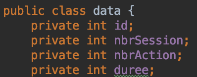
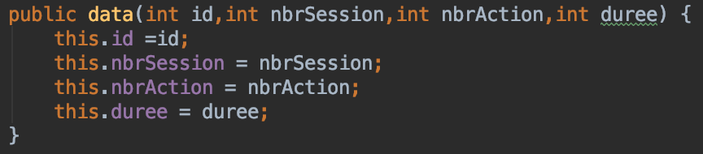
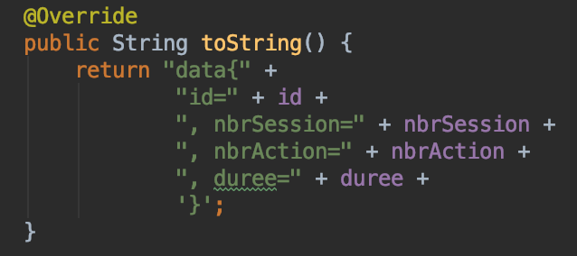

# Détail classe Data

Data représente l'ensemble des donnée comprises entre 2 dates pour un étudiant, c'est à dire qu'à partir de son id on va lui associer le nombres d'actions, de sessions et la durée pour cet idée pour une période donnée.

Ce sont ces informations qui vont être affichées dans l'interface graphique.

## Attributs :  
 
* id : int
* nbrSession : int
* nbrActions : int
* duree : int

## Constructeur :

On instancie l'objet data en lui indiquant un id,un nombre de session, un nombre d'action et une duree.

## Fonction : 

Cette fonction va afficher l'intégraliter de l'objet d'une personne, soit

* son id
* son nombre de session
* son nombre d'actions
* sa durée
