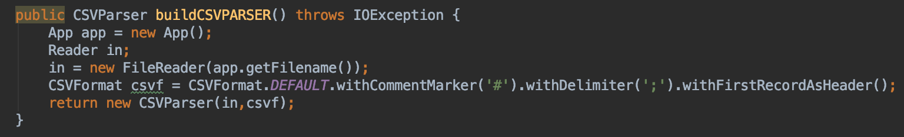
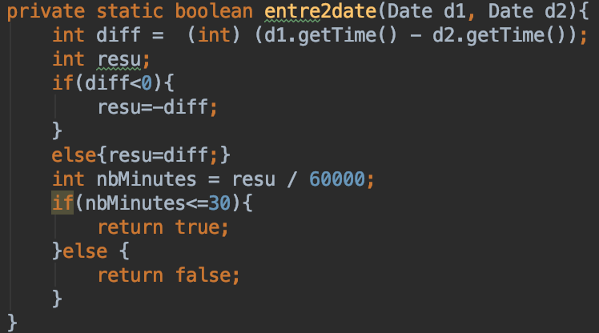
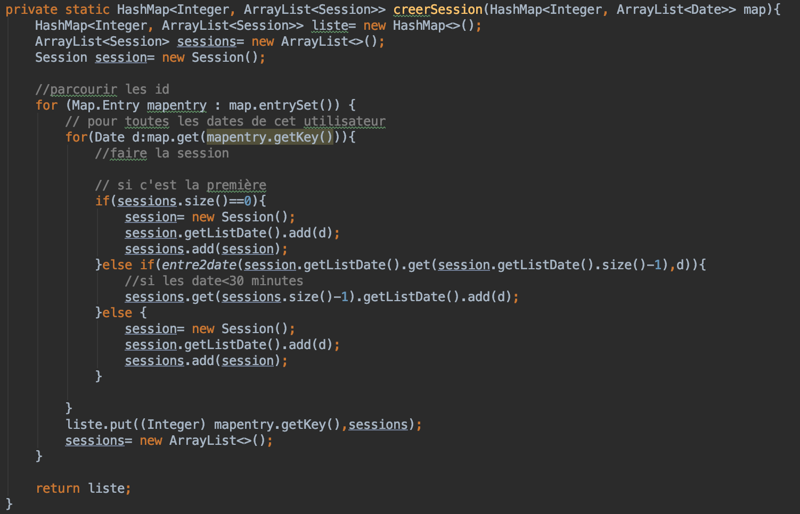
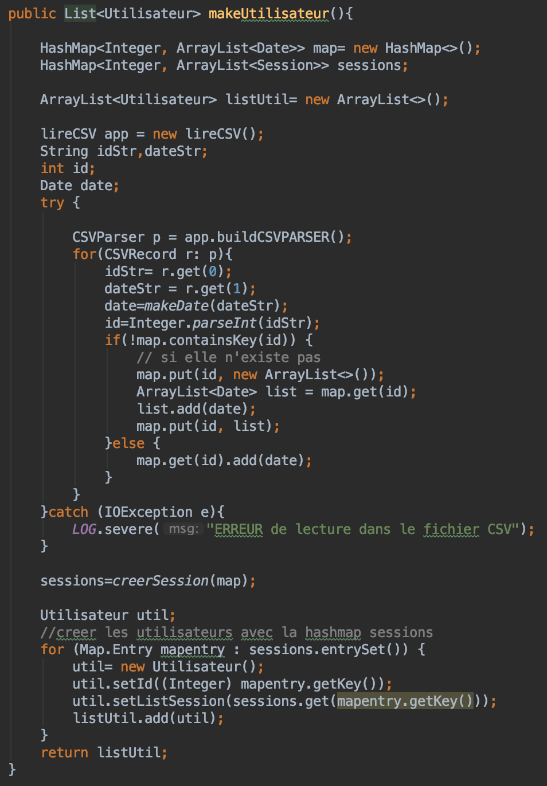
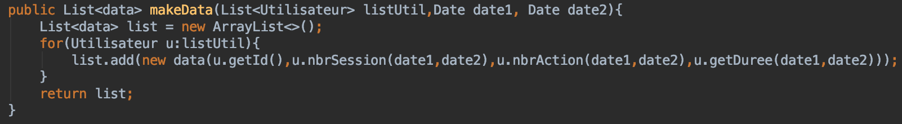

# Détail classe lireCSV

Classe qui permet d'analyser le fichier data.csv et de créer les objets nécessaires. Il comprend des méthodes qui permettent la création des objets Sessions, utilisateur et Data pour pouvoir les traiter par la suite.

## Attributs :   

* LOG : Logger

## Fonctions : 

### buildCSVPARSER

Ces fonctions permettent lire le fichier csv en respectant le format CSV et en enlevant la première ligne (nom des colonnes).

### entre2date

Cette fonction compare 2 dates et dis si elles sont espacées de moins de 30 minutes.

### creerSession

Cette fonction va, à partir d'une liste de dates, créer une liste de session pour chaque étudiant.

Une session correspond à un ensemble de dates espacées par moins de 30 minutes chaqu'une.

### makeDate
Cette fonction va créer une date à partir d'une chaine de caractère.

### makeUtilisateur

Cette fonction va créer une HashMap avec les données parser puis appeler la fonction creerSession qui va retourner une Hashmap de session pour enfin créer les utilisateurs avec leurs sessions assignées (étudiants)

### makeData

Cette fonction va créer une liste de data en fonction d'une periode.

Une data correspond aux données correspondants à un étudiant.
