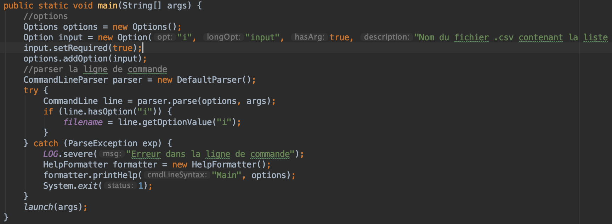
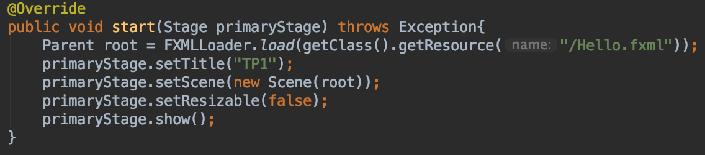

# Détail classe App

Une classe App a été créée pour lancer l'application FXML et la mise en place de l'option pour lancer l'application en ligne de commande en mettant le chemin du fichier csv.

## Attributs : 

* LOG : Logger
* filename: string

## Fonctions :

Cette fonction permet de récupérer l'option passer en paramètre et de set l'attribut filename pour le récupérer par la suite. Ensuite l'application FXML est lancée.

Cette fonction lance l'application FXML.