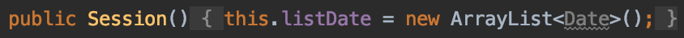
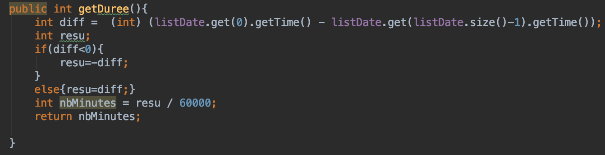
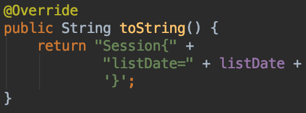

# Détail classe Session

Classe qui permet de créer une session avec les fonctions nécessaires au traitement des données.

## Attributs :   

* listDate : ArrayList<Date>

## Constructeur :
On instancie l'objet Session en créant une nouvelle liste de date.

## Fonctions : 

### getDuree
Cette fonction va calculer la durée d'une session. Donc ajouter la différence entre la date du début de la session et celle de fin.

### toString
Cette fonction va afficher l'ensemble des dates d'une session.

