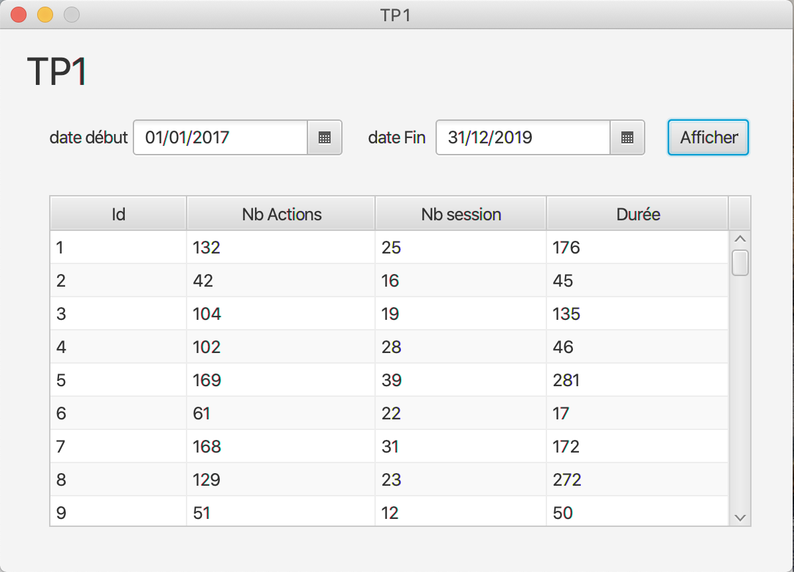

# Utilisation
Un exemple d'utilisation avec comme date de début: 01/01/2017 et date de fin: 31/12/2019 

Selectionner une periode en indiquant la date de début et la date de fin. Une fois fait, cliquer sur "Afficher". 
L'application va calculer, pour chaque étudiant (repérsenté par un id), le nombre d'actions, le nombre de sessions et la durée de celles-ci entre ces 2 dates. 

Il est possible de trier ces colonnes par ordre croissant et décroissant.

La syntaxe pour le lancement : `./app -i [chemin vers fichier csv]`