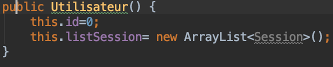
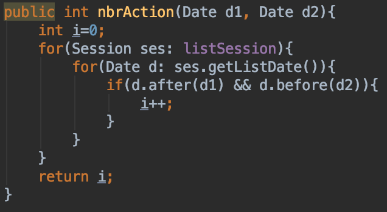
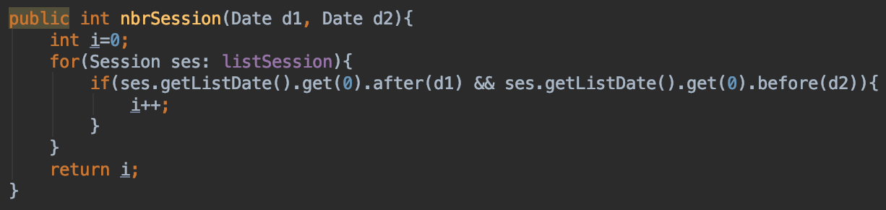
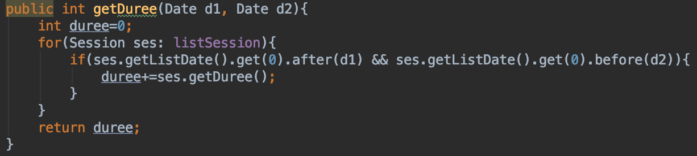

# Détail classe Utilisateur

Classe qui permet de créer un utilisateur (étudiant) avec les fonctions nécessaires au traitement des données.

## Attributs :   

* id : int
* listSession: ArrayList<Session>

## Constructeur :
On instancie l'objet utilisateur.

## Fonctions : 

### nbrAction
Cette fonction va calculer le nombre d'action qu'il y a entre 2 dates pour cet utilisateur

### nbrSession
Cette fonction va calculer le nombre de session qu'il y a entre 2 dates pour cet utilisateur.

Si la date de fin coupe une session en 2, la session sera quand même comptabilisée.

### getDuree
Cette fonction va calculer la durée qu'il y a entre 2 dates pour cet utilisateur.

Si la date de fin coupe une session en 2, la durée entière de la session sera quand même comptabilisée.

